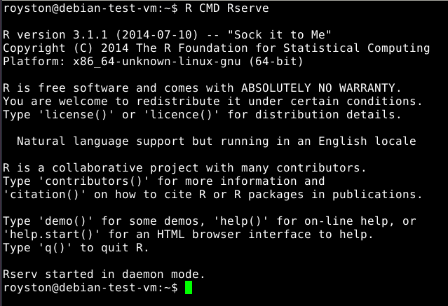

## Robust Joint Tests of SNP and SNP-Environment Interaction

### Introduction
In [Almli et al. (2014)](http://archpsyc.jamanetwork.com/article.aspx?articleid=1919420)
we created a robust test of SNP and SNP-environment interaction for complex traits that
used Huber-White estimates of variance to eliminate bias arising from heteroscedasticity
or other model misspecification. We implemented this test in R script called with
[PLINK](http://pngu.mgh.harvard.edu/~purcell/plink/index.shtml").

We illustrate how to use the R function below.

### The R base system
R is a widely-used, free and open source software environment for statistical computing and graphics.
The most recent version of R can be downloaded from the
[Comprehensive R Archive Network (CRAN)](http://cran.r-project.org/)
CRAN provides precompiled binary versions of R for Windows, MacOS, and select Linux distributions
that are likely sufficient for many users' needs.  Users can also install R from source code;
however this may require a significant amount of effort.
For specific details on how to compile, install, and manage R and R-packages, refer to the manual 
[R Installation and Administration](http://cran.r-project.org/doc/manuals/r-release/R-admin.html).

### R packages required for analysis
Our robust test of SNP and SNP-environment interaction for complex traits requires the installation
of two R libraries:
+ [Rserve](http://cran.r-project.org/web/packages/Rserve/index.html),
required for PLINK to run the R plugin function and
+ [geepack](http://cran.r-project.org/web/packages/geepack/index.html), 
required to obtain the robust variance estimators for the joint interaction test.

The easiest method to install these packages is to open a R session and enter the command:
    install.packages("geepack")
Choose a mirror and the package should automatically download.

A similar command,
    install.packages("Rserve")
should install the Rserve package.

One can also install R packages from the command line
[see more details here](http://cran.r-project.org/doc/manuals/r-release/R-admin.html#Installing-packages).

**Please note that PLINK only provides support for R functions in their Linux-based
and Mac OS distributions.**

### Starting Rserve
There are a few ways to [start Rserve in daemon mode](http://rforge.net/Rserve/faq.html#start).
I. One method uses the command line;  in particular:
    R CMD Rserve
<figure>
  
  <figcaption>Figure 1.  Terminal output after starting Rserve from command line.</figcaption>
</figure>

II. Alternatively, one can start Rserve by saving the following two lines
into a script file called `run-Rserve.R`:

    library(Rserve) 
    Rserve(args="--no-save")

Then the script can be executed through R from the command line
with command `R --vanilla < run-Rserve.R`.

As well, these two lines of R code could also be executed
within an R console or an R environment such as [RStudio](http://www.rstudio.com/).

### Using PLINK to perform robust joint test
Once Rserve is installed and running locally, we can use PLINK to invoke
the R function to perform robust joint testing of SNP and SNP-environment
interaction.  We provide 
[sample PLINK files](test-int-plink.tgz) (PED/MAP/COV) consisting of
500 individuals genotyped for 10 SNPs and assayed for three environmental
predictors.  For each of the 10 SNPs, we wish to perform a joint test and
SNP and SNP-environment interaction using the first environmental
predictor listed in the COV file (the second and third environmental
predictors in the COV file are treated only as covariates).
To perform these analyses on our test dataset, we invoke the following PLINK command:

    plink --file test-int-plink --covar test-int-plink.cov --R robust-joint-int-plugin.R

The command will generate a file 'plink.auto.R'.
Each row of the file corresponds to results from a tested SNP and has the following fields (in order): 

  + Chromosome position
  + SNP id
  + Physical Position (base-pair)
  + Minor allele
  + P-value of model-based test of SNP and SNP-environment interaction
  + P-value of robust test of SNP and SNP-environment interaction

Using the provided sample data, the contents of the this file is shown here:

<pre class="data">
   1    SNP1     101000    2 0.864095	0.839595	
   1    SNP2     102000    2 0.776515	0.836906	
   1    SNP3     103000    2 0.386562	0.376118	
   1    SNP4     104000    2 0.532115	0.642094	
   1    SNP5     105000    2 3.47487e-09	5.04597e-06	
   1    SNP6     106000    2 0.543536	0.563148	
   1    SNP7     107000    2 0.451066	0.397487	
   1    SNP8     108000    2 0.758953	0.75529	
   1    SNP9     109000    2 0.94371	0.947891	
   1   SNP10     110000    2 0.972809	0.972334	
</pre>

The R code can easily be modified to consider other joint interaction tests of interest.
Also, bed, bim, and fam files can also be used.

**Important**:  if one wishes to adjust the robust joint test for gender,
one must include a numeric gender variable in the PLINK COV file.
Use of the `--sex` flag in PLINK will not adjust
the analysis specified in the R plugin function for gender.

More details on writing, calling, and debugging R functions in PLINK 
can be found in the
[PLINK documentation for R plugin functions](http://pngu.mgh.harvard.edu/~purcell/plink/rfunc.shtml).

### Questions and Technical Support

For questions or concerns with the R function, please contact
[Richard Duncan](mailto:rduncan@emory.edu) and 
[Michael Epstein](mailto:mpepste@emory.edu)

We appreciate any feedback you have with our site and instructions. 

